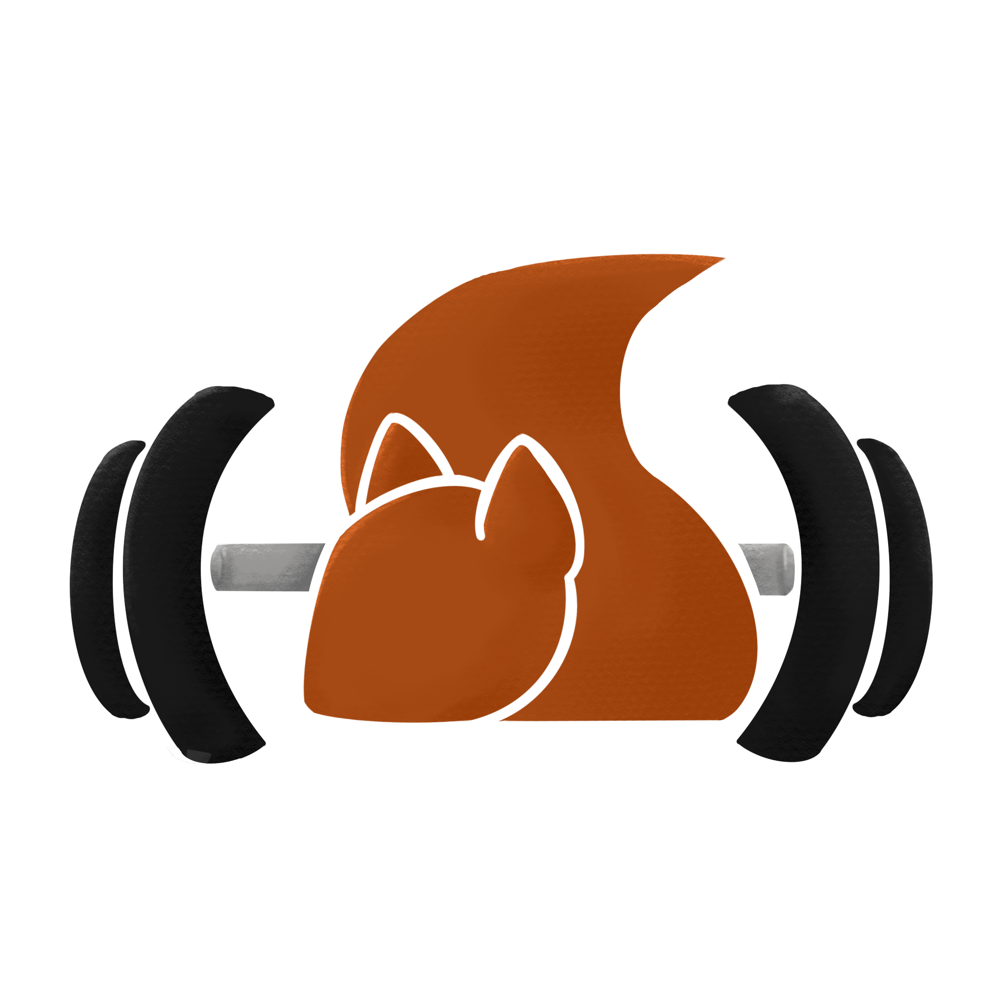

### Language Toggle

[🇮🇹 Italian](#italian-content)
[🇬🇧 English](#english-content)

## Italian Content

<h1>LA TANA DELLO SCOIATTOLO</h1>

A noi piace sollevare ghisa!!

Gli scoiattolini nel tempo libero, oltre a raccogliere ghiande, si riuniscono nella loro tana a praticare la nobile arte del culturismo, impegnandosi a creare schede di allenamento divertenti, stimolanti e, soprattutto, ben strutturate!

-----
progetto per Programmazione Web 

## English Content

<h1>SQUIRREL'S LAIR</h1>

We love lifting weights!!

Squirrels, in their free time, apart from getting acorns, gather in their den to practice the noble art of bodybuilding. They are dedicated to creating fun, inspiring, and well-structured workout routines!

---
This is a project for a Web Programming course
